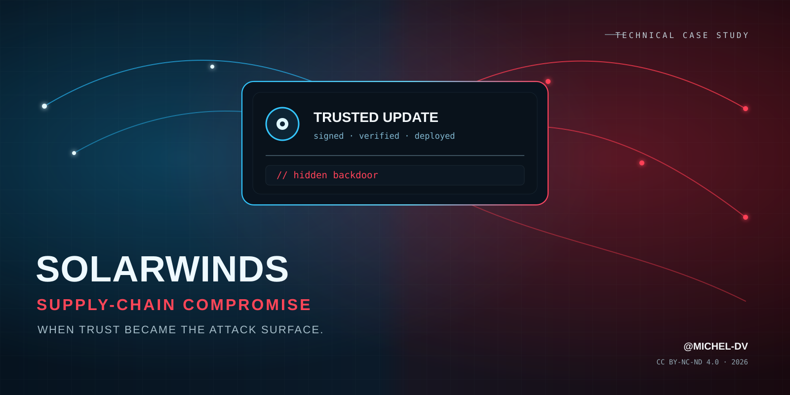

<div align="center">
  

# SolarWinds Supply-Chain Compromise

### Technical Case Study — Anatomy of a Trusted Update Turned Backdoor

**When trust became the attack surface.**

[](https://github.com/Michel-DV/solarwinds-supply-chain-case-study/releases/tag/v1.1.0)
[](report/SolarWinds_Supply_Chain_Case_Study_Michel-DV.pdf)
[](LICENSE)
[](https://github.com/Michel-DV)

**CASE-001 · Final analytical edition**

</div>

---

## Overview

This repository contains a technical reconstruction of the **SolarWinds Orion software supply-chain compromise**, one of the most consequential cyber-espionage operations publicly documented.

The report follows the attack from the compromise of the SolarWinds build environment through **SUNSPOT**, the insertion and distribution of **SUNBURST**, selective victim promotion, post-exploitation, identity abuse, cloud access, incident response, and the defensive lessons that reshaped modern software-supply-chain security.

Version **1.1.0** adds an original analytical layer focused on the trust transitions that made the campaign strategically effective: build control plane → signed artifact → privileged management context → identity conversion → cloud/data access.

> **Core lesson:** a valid signature proves who signed an artifact. It does not prove that the build pipeline producing that artifact was trustworthy.

## Read the report

**[Open the report in the repository →](report/SolarWinds_Supply_Chain_Case_Study_Michel-DV.pdf)**  
**[Download the v1.1.0 release asset →](https://github.com/Michel-DV/solarwinds-supply-chain-case-study/releases/download/v1.1.0/SolarWinds_Supply_Chain_Case_Study_Michel-DV.pdf)**

Integrity check: [`report/SHA256SUMS.txt`](report/SHA256SUMS.txt)

## What changed in v1.1.0

The final analytical edition adds three dedicated sections:

- **Attack-path reconstruction through trust boundaries** — explains where control is converted from build access into signed distribution, privileged execution, identity access and cloud reach.
- **Detection hypotheses** — maps each phase to realistic telemetry questions across CI/CD, DNS, endpoint, identity and cloud logging.
- **Red Team research notes** — translates the campaign into safe, authorized emulation objectives without reproducing a real third-party supply-chain compromise.

The goal is to move the report beyond incident summary and toward a reusable model for **threat research, purple teaming, detection engineering and trust-boundary assessment**.

## Attack chain at a glance

```mermaid
flowchart LR
    A[Compromise build environment] --> B[SUNSPOT build injection]
    B --> C[Trojanized Orion component]
    C --> D[Legitimate signing & release]
    D --> E[Customer installs trusted update]
    E --> F[SUNBURST dormancy & profiling]
    F --> G[DNS beaconing / victim selection]
    G --> H[Operational C2]
    H --> I[Follow-on tooling & valid credentials]
    I --> J[AD / identity / cloud access]
    J --> K[Espionage, persistence & collection]
```



## Key findings

| Finding | Why it matters |
|---|---|
| **The build pipeline was the decisive trust boundary** | SolarWinds stated that the malicious modification was introduced in the automated build process rather than directly in the source-code repository. |
| **Code signing did not fail** | The trojanized component was signed legitimately. The signature authenticated origin; it could not attest to an uncompromised upstream build process. |
| **Broad distribution did not equal broad exploitation** | Fewer than 18,000 customers may have received an affected build, while SolarWinds later estimated fewer than 100 customers were actually reached by the actor through SUNBURST. |
| **SUNBURST was an access broker, not the entire operation** | High-value victims were promoted to additional C2 and follow-on activity involving other tooling, credentials, identity and cloud access. |
| **Identity compromise changes the remediation problem** | Removing Orion is insufficient if the actor has already obtained credentials, token-signing material, service-principal access or cloud persistence. |
| **Long-term telemetry matters** | The campaign demonstrated the value of months of DNS, endpoint, identity, cloud and remote-access logs for retrospective hunting. |

## What the report covers

1. Executive brief and incident profile
2. Scope, confidence and source methodology
3. Why Orion was an ideal strategic target
4. Reconstructed 2019–2021 timeline
5. Supply-chain anatomy: build compromise to victim foothold
6. **SUNSPOT** and build manipulation
7. **SUNBURST** technical behavior, dormancy, DNS and C2
8. Post-exploitation: TEARDROP, RAINDROP, Cobalt Strike and living-off-the-land
9. Active Directory, federation and M365 implications
10. Detection engineering and retrospective hunting opportunities
11. Exposure, victim-selection funnel and coordinated remediation
12. Representative **MITRE ATT&CK** mapping
13. Post-SolarWinds defensive architecture
14. Red Team / Research lessons and study questions
15. **Original analysis — trust-boundary attack-path reconstruction**
16. **Original analysis — detection hypotheses**
17. **Original analysis — safe Red Team research notes**
18. Common myths, historical indicators, glossary and primary sources

## Important distinctions

- **“18,000 organizations were hacked” — inaccurate.** The larger number refers to possible exposure to affected builds, not confirmed follow-on compromise.
- **SUNSPOT ≠ SUNBURST.** SUNSPOT is associated with manipulation of the SolarWinds build process; SUNBURST is the backdoor delivered downstream in Orion builds.
- **The source repository and the build pipeline are different trust boundaries.** A clean repository does not guarantee a clean artifact when the builder is compromised.
- **SUPERNOVA was not “SUNBURST 2.”** CISA assessed SUPERNOVA as a separate malware campaign associated with a different actor.
- **Blocking one historical domain is not remediation.** Credentials, tokens, persistence and follow-on tooling can outlive the original Orion foothold.

## Defensive themes

The report focuses on controls that raise the cost of this class of operation:

- isolated and ephemeral build infrastructure
- workload identity and least privilege in CI/CD
- reproducible or independently verifiable builds
- artifact provenance and attestation
- protected signing services separated from builders
- immutable release artifacts and signed manifests
- deny-by-default egress for management infrastructure
- long-term DNS, endpoint, identity and cloud telemetry
- identity tiering and service-principal governance
- coordinated identity/cloud eviction playbooks

## Reproducible publication

The PDF is generated by the repository itself rather than maintained as an opaque binary-only artifact.

The publication pipeline combines:

- `report/source.html` — base incident reconstruction
- `report/analysis-v1.1.html` — final original analytical sections
- `report/cover.html` — dedicated A4 cover
- `.github/workflows/publish-report.yml` — deterministic assembly, rendering, checksum and release pipeline

The workflow writes the exact assembled source to `report/source-v1.1.html`, renders the PDF, calculates SHA-256 and publishes the versioned release asset.

This deliberately mirrors the central lesson of the incident: **trust the artifact only when you can account for its build path.**

## Methodology

The case study prioritizes **primary and first-party technical sources**, including SolarWinds regulatory disclosures, CISA/NSA/FBI guidance, U.S. GAO material, and Mandiant/FireEye technical reporting. Statements distinguish between confirmed facts, vendor estimates, government attribution and analytical interpretation.

See [`docs/METHODOLOGY.md`](docs/METHODOLOGY.md) and [`docs/REFERENCES.md`](docs/REFERENCES.md).

## Repository structure

```text
.
├── .github/workflows/
│   └── publish-report.yml
├── assets/
│   ├── cover.svg
│   └── cover-mobile-safe.svg
├── docs/
│   ├── METHODOLOGY.md
│   └── REFERENCES.md
├── report/
│   ├── source.html
│   ├── analysis-v1.1.html
│   ├── source-v1.1.html
│   ├── cover.html
│   ├── SolarWinds_Supply_Chain_Case_Study_Michel-DV.pdf
│   └── SHA256SUMS.txt
├── CHANGELOG.md
├── CITATION.cff
├── DISCLAIMER.md
├── RELEASE_NOTES.md
├── LICENSE
└── README.md
```

## Citation

If this case study is useful in research, training, coursework, or internal documentation, please cite the repository or use the included [`CITATION.cff`](CITATION.cff).

**Author:** [@Michel-DV](https://github.com/Michel-DV)  
**Release:** [v1.1.0](https://github.com/Michel-DV/solarwinds-supply-chain-case-study/releases/tag/v1.1.0)  
**Year:** 2026

## Publication status

**CASE-001 is closed at v1.1.0 as the final analytical edition.** Future changes should be limited to factual corrections, broken references or material source updates.

## License

© 2026 **Michel-DV**.

This publication is licensed under **Creative Commons Attribution-NonCommercial-NoDerivatives 4.0 International (CC BY-NC-ND 4.0)**.

You may share the unmodified work with attribution for non-commercial purposes. Commercial use and distribution of modified versions are not permitted under this license. See [`LICENSE`](LICENSE) for details.

## Disclaimer

This is an independent technical study based on publicly available information. It is **not affiliated with or endorsed by SolarWinds, Mandiant, CISA, Microsoft, MITRE, or any other organization referenced in the report**. Historical indicators are included for research and retrospective analysis and should not be treated as current threat intelligence.

---

<div align="center">

**SolarWinds showed that the most dangerous malicious artifact can look exactly like the software an organization already trusts.**

[@Michel-DV](https://github.com/Michel-DV)

</div>
